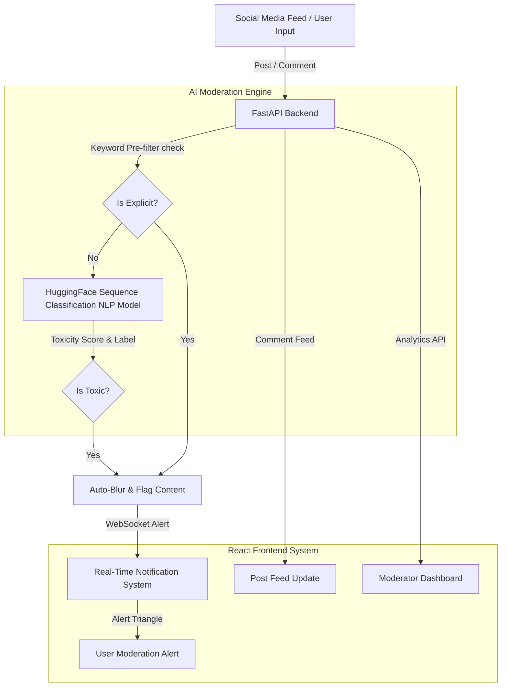
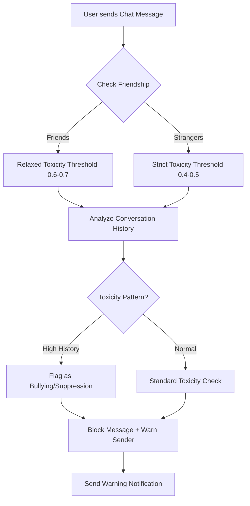

# Socialite: AI Cyberbully & Toxic Comment Detector

End-to-end safety analytics: **User Comments → Sequence Classification NLP Model → Real-Time WebSockets → FastAPI Backend → Live React Dashboard**.

## Architecture



### Chat Message Context-Aware Moderation Flow



## Premium Application Features

1.  **AI Moderation Engine (Important)**: Real-time detection of abusive, hate, and toxic speech using a hybrid pipeline of keyword checks and deep learning sequence classification.
2.  **Context-Aware Chat Moderation**: Detects toxic messages in private chats with relationship-aware thresholds. Friends get relaxed thresholds (friendly teasing allowed), strangers get strict thresholds (bullying/harassment blocked).
3.  **Real-Time WebSocket Notifications**: Integrated STOMP/WebSocket alerts that instantly notify users if a comment violates community guidelines (flashes a red Warning/AlertTriangle).
4. **Analytics & Toxicity Heatmap**: A visual admin layout charting the trends of flagged content, overall user toxicity ratings, and general community health metrics.
5. **Auto-Blur Detection Preview**: A simulated social media feed showing blurred toxic comments natively alongside clean posts.

## Quick Start

```bash
# 1. Clone and enter the project
git clone https://github.com/astha1504/Cyberbully-and-toxic-comment-detector.git
cd Cyberbully-and-toxic-comment-detector

# 2. Create and activate Python virtual environment
cd backend
python -m venv venv
# Windows:
venv\Scripts\activate
# macOS/Linux:
source venv/bin/activate

# 3. Install backend dependencies
pip install -r requirements.txt

# 4. Start the FastAPI backend
uvicorn app.main:app --reload --port 8000

# 5. In a new terminal, install frontend dependencies and start dev server
cd ../frontend
npm install
npm run dev

# 6. Access the Local App
# Open http://localhost:5173
```

- **API docs**: http://localhost:8000/docs  
- **App Dashboard**: http://localhost:5173


## Running the Toxicity Moderation Engine

Place your PyTorch/Safetensors moderation weights under `backend/model/`. If no weights are found, the system intelligently defaults to standard baseline fallback configurations.

Note: `backend/model/` is gitignored because model weights are large files. After cloning, add your trained model files to that directory manually.

## API Endpoints

| Method | Path | Description |
|--------|------|-------------|
| `POST` | `/comments/` | Creates a comment & Triggers Background ML Toxicity Task |
| `POST` | `/chat/conversation` | Creates a conversation between two users |
| `GET` | `/chat/conversations` | Retrieves user's conversation list |
| `GET` | `/chat/messages/{conv_id}` | Retrieves messages for a conversation |
| `WS` | `/ws/notifications` | WebSocket for real-time messaging and chat moderation |
| `PATCH`| `/notifications/read-all` | Marks all moderation socket alerts as Read |
| `POST` | `/posts/{id}/like` | Updates user interaction & handles post engagement |
| `GET`  | `/posts/` | Feed data query with hydrated authors and comments count |
| `GET`  | `/analytics/toxic-comments` | Chart metrics representing weekly flagged content trends |
| `GET`  | `/notifications/` | Real-time fetch of user's personal alerts |

### Chat Toxicity Warning Payload

```json
{
  "type": "toxicity_warning",
  "message": "Harassment detected. This behavior violates community guidelines.",
  "original_content": "offensive message text",
  "toxicity_score": 0.92,
  "label": "suppression_pattern",
  "context": {
    "is_friend": false,
    "conversation_toxicity": 0.7,
    "friendship_modifier": 0.0
  }
}
```

## Moderation payload Schema

```json
{
  "_id": "647f123abc456",
  "post_id": "65b9c1d...",
  "user_id": "673cf82...",
  "content": "This is a hateful comment",
  "moderation_status": "flagged",
  "is_blurred": true,
  "is_toxic": true,
  "toxicity_score": 0.98,
  "created_at": "2026-06-19T14:22:10Z"
}
```

## Context-Aware Moderation Logic

The chat moderation system uses relationship-based thresholds:

| Relationship | Threshold | Warning Message |
|--------------|-----------|-----------------|
| Friends | 0.6-0.7 | "Friendly teasing detected. Keep it respectful." |
| Strangers | 0.4-0.5 | "Potentially harmful language detected." |
| High toxicity pattern | - | "Harassment detected. This violates community guidelines." |

### Conversation History Context

The system analyzes the last 10 messages in a conversation:
- **0-2 toxic messages**: Standard toxicity check
- **3-4 toxic messages**: Label as "potential_bullying"
- **5+ toxic messages**: Label as "suppression_pattern" (likely targeted harassment)

## Live WebSockets & Moderation Demo 

The frontend implements a robust WebSocket connection. To watch your comments get detected and flagged live:

```bash
# Terminal 1 — start API
cd backend && uvicorn app.main:app --port 8000

# Terminal 2 — start dashboard
cd frontend && npm run dev
```

Open http://localhost:5173, log into your profile, and test posting an abusive keyword. Watch the **🔴 Moderation Warning** slide in dynamically through your notification system, instantly blurring the text on the public feed!

## Tests

```bash
cd backend
pytest tests/ -v
pytest tests/ --cov=app --cov-report=term-missing
```

Covers: ML pipeline fallback testing, background task integration, WebSocket payloads, toxicity keyword exact matching, and missing field validation.

## Data Structure (read-only)

| Path | Contents |
|------|----------|
| `backend/model/*.safetensors` | Neural Network Weights |
| `backend/model/config.json` | Tokenizer configuration and `id2label` mapping |
| `backend/app/services/moderation_service.py` | Asynchronous ML inference, keyword filtering, and context-aware chat moderation |
| `backend/app/database.py` | MongoDB connection & collections instance |
| `backend/fix_data.py` | Custom Faker script resolving ID constraints |
| `backend/app/routes/websockets.py` | WebSocket handlers with integrated toxicity moderation |

**Never modify raw tensors under `backend/model/`.**

## Edge Cases Handled

| Edge Case | How We Handle It |
|-----------|-----------------|
| ML Model Missing/Loading | Automatically falls back to keyword-based filtering + sets safety flags while PyTorch loads into memory |
| Socket Disconnects | React `useSocket` reconnects. Missed alerts are re-polled via standard HTTP GET `/notifications/` |
| Invalid Comment Data | Schema validation catches missing text/empty strings before it ever hits the HuggingFace Transformer |
| UI Empty States | Empty suggestions/notifications render bespoke empty-state "Zero items" mockups gracefully |
| Null Relational Data | Custom script (`fix_data`) injects strict `ObjectId` mapping to prevent `Unknown` user rendering |
| Toxic Chat Message | Blocked before delivery. Sender receives warning notification instead. |
| Friend vs Stranger Context | Different toxicity thresholds applied based on relationship status. |
| Conversation Suppression Patterns | Repeated toxicity triggers bullying/suppression detection. |

See [CHOICES.md](CHOICES.md) for architecture and decision rationale.
