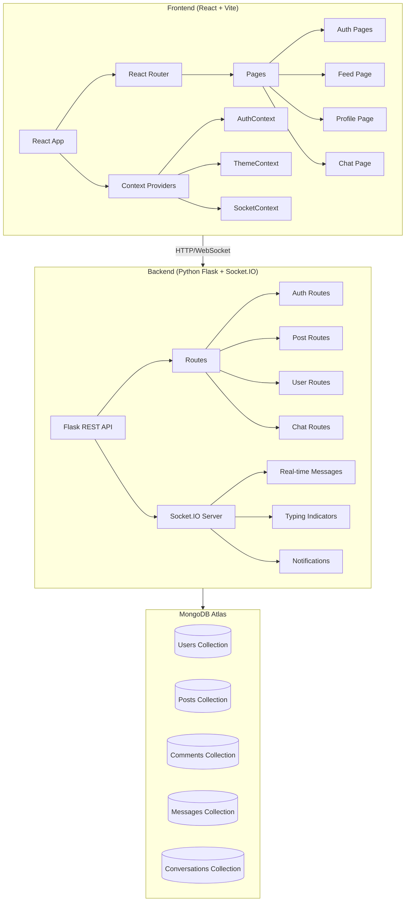

# Social Media Platform - Implementation Plan

## 🏗️ Architecture Overview



## 📦 Tech Stack

| Layer | Technology |
|-------|-----------|
| Frontend | React 18 + Vite |
| Styling | Vanilla CSS (Instagram-inspired) |
| State Management | React Context + useReducer |
| Real-time | Socket.IO Client |
| Backend | Python Flask |
| Real-time Server | Flask-SocketIO |
| Database | MongoDB Atlas (via PyMongo) |
| Auth | JWT + bcrypt (salted hashing) |
| File Upload | Cloudinary / Base64 |
| HTTP Client | Axios |

## 🎯 Features Checklist

### Phase 1: Project Setup & Auth
- [x] Initialize React (Vite) frontend
- [x] Initialize Python Flask backend
- [x] MongoDB Atlas connection
- [x] User Registration with salted password hashing
- [x] User Login with JWT tokens
- [x] Protected routes

### Phase 2: Posts & Feed
- [ ] Create posts (caption + images)
- [ ] Feed page with all posts
- [ ] Like / Unlike posts
- [ ] Delete posts
- [ ] Comments on posts
- [ ] View all comments
- [ ] Delete comments

### Phase 3: User Profiles
- [ ] Profile page with user details
- [ ] Change profile picture
- [ ] Update email, password, name
- [ ] Add/Edit bio
- [ ] Follow / Unfollow users
- [ ] Followers & Following lists
- [ ] User's posts on profile

### Phase 4: Search & Suggestions
- [ ] Search users with autocomplete
- [ ] User suggestions sidebar

### Phase 5: Real-time Chat
- [ ] Chat page with conversation list
- [ ] Real-time messaging via Socket.IO
- [ ] Typing indicators
- [ ] Search conversations
- [ ] New message notifications
- [ ] Dark mode support for chat

### Phase 6: Theme & Polish
- [ ] Dark / Light mode toggle (global)
- [ ] Responsive design (mobile-first)
- [ ] Animations & micro-interactions
- [ ] Instagram-inspired UI polish

## 📁 Project Structure

```
social media app/
├── frontend/               # React + Vite
│   ├── public/
│   ├── src/
│   │   ├── assets/
│   │   ├── components/
│   │   │   ├── Auth/
│   │   │   ├── Feed/
│   │   │   ├── Post/
│   │   │   ├── Profile/
│   │   │   ├── Chat/
│   │   │   ├── Layout/
│   │   │   └── Common/
│   │   ├── context/
│   │   ├── hooks/
│   │   ├── pages/
│   │   ├── services/
│   │   ├── utils/
│   │   ├── App.jsx
│   │   ├── App.css
│   │   ├── index.css
│   │   └── main.jsx
│   ├── package.json
│   └── vite.config.js
│
├── backend/                # Python Flask
│   ├── app/
│   │   ├── __init__.py
│   │   ├── config.py
│   │   ├── models/
│   │   ├── routes/
│   │   ├── middleware/
│   │   ├── utils/
│   │   └── socket_events.py
│   ├── requirements.txt
│   ├── run.py
│   └── .env
│
└── README.md
```

## ⏱️ Build Order
1. Backend foundation (Flask + MongoDB + Auth)
2. Frontend foundation (Vite + Router + Auth pages)
3. Posts CRUD + Feed
4. Profiles + Follow system
5. Search + Suggestions
6. Real-time Chat
7. Theme + Final polish
